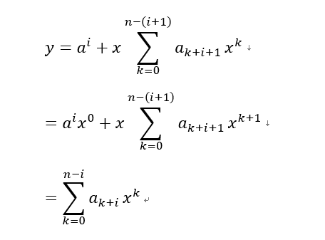
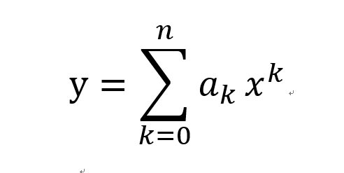

# 第一部分  基础知识

## 第2章 算法基础

### 2.1 插入排序

###### 2.1-1 以图2-2为模型，说明INSERTION—SORT在数组*A*=⟨31,41,59,26,41,58⟩上的执行过程。

*A*=⟨31,41,59,26,41,58⟩

*A*=⟨31,41,59,26,41,58⟩

*A*=⟨26,31,41,59,41,58⟩

*A*=⟨26,31,41,41,59,58⟩

*A*=⟨26,31,41,41,58,59⟩

###### 2.1-2 重写过程INSERTION-SORT，使之按非升序（而不是非降序）排序。

[INSERTION-SORT的升序排序实现]()

```c++
template<typename Iterator,typename CompareType=std::less<typenamestd::iterator_traits<Iterator>::value_type>> 
void insert_sort(const Iterator begin, const Iterator end, CompareType compare = CompareType()) {
			auto size = std::distance(begin, end);
			if (size <= 1)  return;
			auto current = begin;
			while (++current != end) {
				auto key = *current;
				auto small_next = current;
				while (small_next != begin && compare(key, *(small_next - 1))) {
					*small_next = *(small_next - 1);
					--small_next;
				}
				*small_next = key;
			}
		}
```

###### 2.1-3  [解答](https://walkccc.github.io/CLRS/Chap02/2.1/)


###### 2.1-4 考虑把两个n位二进制整数加起来的问题，这两个整数分别存储在两个n元数组A和B中。这两个证书的和应按二进制行是存储在一个（n+1）元数组C中。请给出该问题的形式化描述，并写出伪代码。

num1, num2 表示两个二进制整数，数组的下标0-n 对应整数的低位到高位。

```c++
vector<int> sum(vector<int> num1, vector<int> num2){
    vector<int> result(num1.size() + 1);
    int bit = 0;
	for(int i = 0; i < num1.size(); ++i){
        int temp = num1[i] + num2[i] + bit;
        bit = temp / 2;
        result[i] = temp % 0;
    }
    result[result.size()-1] = bit;
    return result;
}
```


### 2.2 分析算法

###### 2.2-1 

用Θ记号表示函数n^3 / 1000 - 100n^2 - 100n + 3。

Θ（n^3)


2.2-2 

Consider sorting n*n* numbers stored in array A*A* by first finding the smallest element of A*A* and exchanging it with the element in A[1]*A*[1]. Then find the second smallest element of A*A*, and exchange it with A[2]*A*[2]. Continue in this manner for the first n - 1*n*−1 elements of A*A*. Write pseudocode for this algorithm, which is known as ***selection sort\***. What loop invariant does this algorithm maintain? Why does it need to run for only the first n - 1*n*−1 elements, rather than for all n*n* elements? Give the best-case and worst-case running times of selection sort in \ThetaΘ-notation.

伪代码：

```
n = A.legth
for i = 1 to n-1:
	minIndex = i
	for j=i to n:
		if A[j] < A[minIndex]
			minIndex = j
	swap(A[i], A[minIndex])
```


选择排序C++代码：

```c++
		template<typename Iterator, typename CompareType = std::less<typename std::iterator_traits<Iterator>::value_type>>
		void selection_sort(const Iterator begin, const Iterator end, CompareType compare = CompareType()) {
			auto size = std::distance(begin, end);
			if (size <= 1)  return;
			auto i = begin;
			while ( i != end) {
				auto j = i;
				auto key = j;
				while (j != end) {
					if (compare(*j, *key)) {
						key = j;
					}
					j++;
				}
				auto temp = *i;
				*i = *key;
				*key = temp;
				i++;
			}
		}
```


循环不变式：在第 i 轮循环中，由数组中的最小的 i-1 个数按顺序排列组成，即子数组A[1,2,...,i-1] 。

对前 n-1 个元素运行即表示从数组A中选择出最小的n-1个数并排序，则剩下的那个数一定是数组中最大的数。

最好最坏情况下的时间复杂度均为 Θ（n^2）


###### 2.2-3

平均需要检查 n/2 个元素。最坏情况为，检查n个元素，即最后一个元素位要查找的元素。两种情况的时间复杂度均为Θ（n）。

###### 2.2-4

可以通过添加特殊情况实例来修改算法，使其具有最佳情况下的时间复杂度。如果输入与此特殊情况匹配，则返回预先计算的答案。


### 2.3 设计算法

###### 2.3-1 使用图2-4作为模型，说明归并排序数组A={ 3,41,52,26,38,57,9,49 }上的操作。

 						3,9,26,38,41,49,52,57

 			3,26,41,52					9,38,49,57

  	3,41,			26,52		  38,57,           9,49

  3,       41,      52,      26    38,      57,      9,     49


###### 2.3-2 重写过程MERGE，使之不使用哨兵，二十一旦数组L或R的所有元素均被复制回A就立刻停止，然后把另一个数组的剩余部分赋值回A

```
MERGE(A,l,m,r)
n1 = m - l + 1
n2 = r - m
let L[1...n1]  and R[1..n2] be new arrays
i = 1, j = 1,cur = 1
while(i != n1 && j != n2)
	while(L[i] < R[j])  A[cur++] = L[i++]
	while(R[j] <= L[i]) A[cur++] = R[j++]
if(i != n1 && j == n2)
	for i to n1
    	A[cur++] = L[i++]
if(i == n1 && j != n2)
	for i to n1
    	A[cur++] = R[j++]
```


###### 2.3-3 使用数学归纳法证明：当n刚好是2 的幂时，以下递归式的解是T(n)=nlgn.

​        	{ 2                若*n*=2,

*T*(*n*)=

​			{ 2*T*(*n*/2)+*n*  若*n*=2,if *n*=2*k*,for *k*>1


- Base case

For n = 2^1   *n*=2^1, T(n) = 2lg 2 = 2*T*(*n*)=2lg2=2.

- Suppose n = 2^k  , T(n) = nlg n = 2^k lg 2^k = k2^k.

For n = 2^{k + 1}*n*=2*k*+1,

\begin{aligned} T(n) & = 2T(2^{k + 1} / 2) + 2^{k + 1} \\ & = 2T(2^k) + 2^{k + 1} \\ & = 2 \cdot 2^kk + 2^{k + 1} \\ & = 2^{k + 1}(k + 1) \\ & = 2^{k + 1} \lg 2^{k + 1} \\ & = n\lg n. \end{aligned}*T*(*n*)=2*T*(2*k*+1/2)+2*k*+1=2*T*(2*k*)+2*k*+1=2⋅2*k**k*+2*k*+1=2*k*+1(*k*+1)=2*k*+1lg2*k*+1=*n*lg*n*.

By P.M.I., T(n) = n\lg n*T*(*n*)=*n*lg*n*, when n*n* is an exact power of 22.


###### 2.3-4

We can express insertion sort as a recursive procedure as follows. In order to sort A[1..n]*A*[1..*n*], we recursively sort A[1..n - 1]*A*[1..*n*−1] and then insert A[n]*A*[*n*] into the sorted array A[1..n - 1]*A*[1..*n*−1]. Write a recurrence for the running time of this recursive version of insertion sort.

​			{  Θ(1),  n = 1;

T(n) = 

​			{  T(n-1)  +  Θ(1)  ;  n > 1

Θ(n^2)


###### 2.3-5 

Referring back to the searching problem (see Exercise 2.1-3), observe that if the sequence A*A* is sorted, we can check the midpoint of the sequence against v*v* and eliminate half of the sequence from further consideration. The ***binary search\*** algorithm repeats this procedure, halving the size of the remaining portion of the sequence each time. Write pseudocode, either iterative or recursive, for binary search. Argue that the worst-case running time of binary search is \Theta(\lg n)Θ(lg*n*).


```c++
//迭代版本：
typename <class T, Iterator iterator>
int BINARY-SEARCH(vector<T> A,const T& v,iterator low,iterator high){
    auto mid = low + std::distance(low, hihg);
    while(low < high){
        auto mid = low + std::distance(low, hihg)/2;
        if(v == *mid)  return mid;
        if( *mid < v)  low = mid + 1;
        else            high = mid;
    }
    //没有符合条件的值
    return -1;
}


//递归版本：
typename <class T, Iterator iterator>
int BINARY-SEARCH(vector<T> A,const T& v,iterator low,iterator high){
    if(std::distance(low, high) <= 1)  return -1; 
    auto mid = low + std::distance(low, hihg);
    if(v == *mid)  return mid;
    if( *mid < v)  return BINARY-SEARCH(A,v,mid+1,high);
    else           return BINARY-SEARCH(A,v,low,mid);
    //没有符合条件的值
    return -1;
}
	
```


###### 2.3-6 注意到2.1节中的过程INSERTON-SORT的第5~7行的while循环采用一种线性查找来（反向）扫描以排好序的子数组*A*[*i*..*j*−1]。我们可以使用二分查找来把插入排序的最坏情况总运行时间改进到Θ(*n*lg*n*)么。

​	5~7的while循环不仅线性扫描不小于A[j]的目标值，同时将大于A的值右移一个位置。而使用二分查找无法完成元素的移动操作。所以不能。


###### 2.3-7 描述一个运行时间为Θ(*n*lg*n*)的算法，给定n个整数的集合S和另一个整数x，该算法嫩南瓜确定S中是否存在两个其和刚好为x的元素。

```c++
	vector<int> twoSum(vector<int>& nums, int target) {
        vector<int> result;
        sort(nums.begin(), nums.end());   // 排序算法时间复杂度为Θ(nlgn)
        for(int i = 0; i < nums.size(); i++){
            int temp = target - nums[i];
            int low = i+1, high =nums.size() - 1;
            while(low <= high){            //  二分查找，时间复杂度（单次）Θ(lgn)
                int mid = low + (high - low) / 2;
                if(nums[mid] == temp && i != mid){
                    result.push_back(nums[i]);
                    result.push_back(nums[mid]);
                    return result;
                }
                else if(nums[mid] < temp)  low = mid + 1;
                else high = mid-1;
        }
    }
    return result;
    }
}
```

算法中，排序算法时间复杂度为Θ(nlgn)； 二分查找的单次时间复杂度为Θ(lgn) ， 总和为 nΘ(lgn) 。故算法总时间复杂度为Θ(*n*lgn）


### 思考题

###### 2-1 

（在归并排序中对小数组采用插入排序）虽然归并排序的最会情况运行时间为nΘ(lgn)，而插入排序的最坏情况运行时间为Θ(n^2),但是插入排序中的常量银子可能使得它在n较小时，在许多机器上实际运行得更快。因此，考虑对归并排序的一种修改，其中使用插入排序来排序长度为k的n/k个子表，然后使用标准的合并机制来合并这些子表，这里k是一个待定的值。

a. 证明：插入排序最坏情况可以在Θ(nk)时间内排序每个长度为k的n/k个子表。

b.表明在最坏情况下如何在Θ(nlgn/k)时间内合并这些子表。

c. 假定修改后的算法的最坏情况运行时间 Θ(nk + nlg(n/k)  ) ， 要是修改后的算法与标准的归并排序具有相同的运行时间，作为n的一个函数，借助Θ 记号，k的最大值是什么？

d. 在实践中，我们应该如何选择k


a : 对于规模为m的问题，插入排序最坏情况下为Θ( m^2 ),。则，结果为  Θ(  (n/k)  * k^2  )  = Θ(nk  )

b:  对于归并排序，已有n/k 个已排序的 规模为k 的子数组， 则 将 n/k 个子数组 合并为 一个数组，最多需要 lg(n/k) 步，每一步的时间复杂度为 Θ(n)  )故最坏情况运行时间 

Θ(nk  ) （排序子数组）+ Θ( nlg(n/k)  )（归并） =   Θ(nk + nlg(n/k)  )

c:  由假定可得   Θ(nk + nlg(n/k)  )  =  Θ( nlgn )

​    Θ(nk + nlg(n/k)  )   =  Θ(  nk + nlgn  -   nlgk   )  = Θ( nlgn )  （nlgk 与 nk相比，lgk的 增长数量级更小，故可忽略）

则   Θ(  nk + nlgn  )   ，  Θ(  nk )  = Θ(  nlgn  ) ,  故k的最大值为  lgn。

d： 选择 插入排序比归并排序块的最大子数组的长度为k


###### 2-2  

Bubblesort is a popular, but inefficient, sorting algorithm. It works by repeatedly swapping adjacent elements that are out of order.

```
BUBBLESORT(A)
    for i = 1 to A.length - 1
        for j = A.length downto i + 1
            if A[j] < A[j - 1]
                exchange A[j] with A[j - 1]
```

**a.** Let A'*A*′ denote the output of \text{BUBBLESORT}(A)BUBBLESORT(*A*) To prove that \text{BUBBLESORT}BUBBLESORT is correct, we need to prove that it terminates and that

A'[1] \le A'[2] \le \cdots \le A'[n], \tag{2.3}*A*′[1]≤*A*′[2]≤⋯≤*A*′[*n*],(2.3)

where n = A.length*n*=*A*.*l**e**n**g**t**h*. In order to show that \text{BUBBLESORT}BUBBLESORT actually sorts, what else do we need to prove?

The next two parts will prove inequality \text{(2.3)}(2.3).

**b.** State precisely a loop invariant for the **for** loop in lines 2–4, and prove that this loop invariant holds. Your proof should use the structure of the loop invariant proof presented in this chapter.

**c.** Using the termination condition of the loop invariant proved in part (b), state a loop invariant for the **for** loop in lines 1–4 that will allow you to prove inequality \text{(2.3)}(2.3). Your proof should use the structure of the loop invariant proof presented in this chapter.

**d.** What is the worst-case running time of bubblesort? How does it compare to the running time of insertion sort?


a :  需要证明，A`中的元素与A相同且有序排列。

b ： 循环不变式：  在2~4行的for循环开始与结束时 A[j..n] 与 原数组A[j..n] 中的元素相同， 但顺序不同。循环结束时 A[j] 为A[j..n] 中最小的元素。

​	初始化：初始时，子数组中只包含1个元素，即为子数组中的最小元素。

​	保持：在每一次迭代时，比较 A[j] 与 A[j-1]  使 A[j-1] 为子数组中的最小的元素，同时，子数组长度增加1。

​	终止： 循环的终止条件为，j = i 。 由循环不变式可知， A [i]为 子数组 A[]i..n 中最小的元素 。

c: 循环不变式：A[1..i]  为 数组A[1..n] 中最小的 i 个元素排序组成。A[i+1 .. n] 由A[1..n] 中的剩余 n - i 个元素组成。

​	初始化：当 i = 1 时，由b中的循环不变式可得， A[1] 为 A[1..n] 中的最小元素。

​	保持： 第1行中的for循环第 i 轮开始与结束前后，A[1..n] 中的元素始终相同单顺序不同。 2~4 行for循环的循环不变式 使得 A[i] 为 A[i..n] 中的最小元素。

​	终止： 循环终止条件为 i = n  。当i = n - 1 时，该轮迭代结束时，A[1..n-1] 为 A[1..n] 中最小的n-1个元素有序排列， 故A[n] 为原数组中的最大元素，可知终止时算法正确。

d： 冒泡排序的最坏时间复杂度为 Θ(  n^2 )  与  插入排序最坏时间复杂度相同。


###### 2-3 

The following code fragment implements Horner's rule for evaluating a polynomial
$$
\begin{aligned} P(x) & = \sum_{k = 0}^n a_k x^k \\ & = a_0 + x(a_1 + x (a_2 + \cdots + x(a_{n - 1} + x a_n) \cdots)), \end{aligned}
$$

$$ {给定系数}
给定系数a_0, a_1, \ldots, a_na 
0
​	
 ,a 
1
​	
 ,…,a 
n和x的值，代码片段
$$

```
y = 0
for i = n downto 0
    y = a[i] + x * y
```

**a.** In terms of \ThetaΘ-notation, what is the running time of this code fragment for Horner's rule?

**b.** Write pseudocode to implement the naive polynomial-evaluation algorithm that computes each term of the polynomial from scratch. What is the running time of this algorithm? How does it compare to Horner's rule

**c.** Consider the following loop invariant: At the start of each iteration of the **for** loop of lines 2-3,

y = \sum_{k = 0}^{n - (i + 1)} a_{k + i + 1} x^k.*y*=*k*=0∑*n*−(*i*+1)*a**k*+*i*+1*x**k*.

Interpret a summation with no terms as equaling 00. Following the structure of the loop invariant proof presented in this chapter, use this loop invariant to show that, at termination, y = \sum_{k = 0}^n a_k x^k*y*=∑*k*=0*n**a**k**x**k*.

**d.** Conclude by arguing that the given code fragment correctly evaluates a polynomial characterized by the coefficients a_0, a_1, \ldots, a_n*a*0,*a*1,…,*a**n*.

a ： Θ（n）

b ： 

```c++
int NAIVE-HORNER(vector<int> cof, int x){
	int result = 0;
	for(int i = 0; i < cof.size(); ++i){
        int temp = 1;
        for(int j = 1; j <= k; j++){
            temp = temp * x;
        }
		result = result + temp * cof[i];
	}
    return result;
}
```

时间复杂度为 Θ（n^2）


c ： 

​	初始时： y= 0。

​	维持： 在循环开始时(即上一轮循环结束时)有：


​				在运行中至结束时有：



终止： 循环结束时 i = 0， 即在最后一轮循环结束时有



d ： 循环的不变量是一个给定系数的多项式的和。


###### 2-4 

假设A[1..n]是一个由n个不同数的数组。若i < j 且 A[i] > A[j], 则对偶(i , j) 成为A的一个逆序对。

**a.** List the five inversions in the array \langle 2, 3, 8, 6, 1 \rangle⟨2,3,8,6,1⟩.

**b.** What array with elements from the set \{1, 2, \ldots, n\}{1,2,…,*n*} has the most inversions? How many does it have?

**c.** What is the relationship between the running time of insertion sort and the number of inversions in the input array? Justify your answer.

**d.** Give an algorithm that determines the number of inversions in any permutation of n*n* elements in \Theta(n\lg n)Θ(*n*lg*n*) worst-case time. (\textit{Hint:}*Hint:* Modify merge sort).

a ：  (1, 5), (2, 5), (3,4), (3,5), (4,5).

b : 当数组按逆序有序排列时逆序对最多， 为n(n-1)/2

c : 插入排序的元素移动次数与逆序对的数量相同。故，插入排序的运行时间为 逆序对数量的常数倍。

```c++
	int count = 0;         // 逆序对个数	

template<typename Iterator, typename CompareType=std::less<typename std::iterator_traits<Iterator>::value_type>> 
		void merge(const Iterator begin, const Iterator mid,const Iterator end, CompareType compare = CompareType()) {
			typedef typename std::iterator_traits<Iterator>::value_type T;
			int n1 = std::distance(begin, mid);
			int n2 = std::distance(mid, end);
			std::vector<T> result(n1 + n2);
			auto current = result.begin();
			auto left_current = begin;
			auto right_current = mid;
            int count = 0;         // 逆序对个数
			while (left_current != mid && right_current != end) {
				if (compare(*left_current, *right_current)    *current++ = *left_current++;//左侧较小
				else{
                    *current++ = *right_current++;//左侧较小
                    count += mid - left_current;
                }                                          
			}
			if (left_current == mid && right_current != end) { std::copy(right_current, end, current); }
			if (right_current == end && left_current != mid) { std::copy(left_current, mid, current); }
			std::copy(result.begin(), result.end(), begin);
		}
                    
       		template<typename Iterator, typename CompareType=std::less<typename std::iterator_traits<Iterator>::value_type>> 
		void merge_sort(const Iterator begin, const Iterator end, CompareType compare = CompareType()) {
			auto size = std::distance(begin, end);
			if (size > 1) {
				Iterator mid = begin + size / 2;
				merge_sort(begin, mid,compare);
				merge_sort(mid, end,compare);
				merge(begin, mid, end,compare);
			}
		}             
                    
                    
```

LeetCode参考题目：[剑指 Offer 51. 数组中的逆序对]     https://leetcode-cn.com/problems/shu-zu-zhong-de-ni-xu-dui-lcof/


## 第3章 函数的增长

#### 3.1  渐进记号

###### 3.1-1

假设f(n) 与 g(n) 都是渐进非负函数。使用 Θ记号的基本定义来证明max(f(n) , g(n) ) = Θ( f(n) + g(n) ) 。

答：Θ 记号表示以下函数的集合：

Θ（g（n）） = { f（n）：存在正常量c1, c2 和 n0 ， 使得对所有 n > n0, 有0 <= c1g(n) <= f(n) <= c2g(n)  }

f(n) + g(n) <=  (  f(n) + g(n)   )  / 2  <=  max(f(n) , g(n) )   <=   f(n) + g(n)   

令c1 = 1/2 ， c2 = 1，  对于任意 n > 0  存在：

(  f(n) + g(n)   )  / 2  <=  max(f(n) , g(n) )   <=   f(n) + g(n)   ，故  max(f(n) , g(n) ) = Θ( f(n) + g(n) )


###### 3.1-2

证明：对任意实常量a 和 b ， 其中 b>0 ，有  ( n + a ) ^ b  =  Θ (n ^ b )

由Θ定义可知，需：

c1 n ^ b  <=   ( n + a ) ^ b    <=  c  2n ^ b

 c1 ^ b  <= ( 1 + a/n ) ^ b  <=  c2 ^ b

c1 <=  1 + a/n  <=  c2 

对任意 n0 >= 1  :

令  c1 =  （ 1 - |a / n0  | ）^ b ，   c2 =  （ 1 + |a / n0  | ）^ b

则有   c1 n ^ b  <=   ( n + a ) ^ b    <=  c  2n ^ b , 故  ( n + a ) ^ b  =  Θ (n ^ b )

###### 3.1-3

解释为什么“算法A的运行时间至少是 O(n ^ 2) ”这一表述是无意义的。

###### 3.1-4

2 ^ (n+1) = O(2 ^ n) 成立么？ 2 ^ 2n = O(2 ^ n)  成立么 ？

O( g(n) ) 表示以下函数的集合：

O( g(n) )  = { f（n）：存在正常量c 和 n0 ， 使得对所有 n > n0, 有0  <= f(n) <= cg(n)  }

由定义可得需：

​		2 ^ (n+1) <= c 2 ^ n  ,  当 c = 4 时， 对任意 n > 1 成立， 故  2 ^ (n+1) = O(2 ^ n) 成立

​		2 ^ 2n <= c 2 ^ n  , 需  c >= 2 ^ n,  故2 ^ 2n = O(2 ^ n)  不成立。

###### 3.1-5

证明定理3.1

由 f (n) = O（g（n））, f( n ) = Ω（g（n））可得：

0 <= c1 g(n) <=  f (n) ,  n >= n1 ;

0 <=  f (n)  <= c2 g(n)  ,  n >= n2 ;

则 令 n0  =  max( n1 , n2 )

对 n > n0 有 ： 0 <= c1g(n) <= f(n) <= c2g(n) 

由 f（n） =   Θ（g（n）），根据定义选取参数 c1, c2 ,n0 可得 f (n) = O（g（n））, f( n ) = Ω（g（n））


###### 3.1-6

证明： 一个算法的运行时间为 Θ（g（n）），当且仅当其最坏情况运行时间为 O（g（n）），且其最好情况运行时间为 Ω（g（n））。

设 Tw  ,  Tb  为最坏与最好运行时间

 0≤ c1g(n)  ≤  Tb(n)    for *n*>nb

0≤Tw(n)≤c2g(n) for  for *n*>nw.  可得

0≤*c*1*g*(*n*)≤*T**b*(*n*)≤*T**w*(*n*)≤*c*2*g*(*n*) for *n*>max(*n**b*,*n**w*).  即为  Θ（g（n）） 的定义。


###### 3.1-7

证明： o( g(n) ) ∩ ω ( g(n) )  为空集。

假设存在函数 f (n) 使得  f (n)  = o（g（n）），  f( n ) =ω （g（n）），

则需  n →  ∞ 时： f (n)  / g（n）= 0，且 g（n）/  f (n)  = 0 ，不存在该函数，所以为空集。

###### 3.1-8

> We can extend our notation to the case of two parameters n*n* and m*m* that can go to infinity independently at different rates. For a given function g(n, m)*g*(*n*,*m*) we denote O(g(n, m))*O*(*g*(*n*,*m*)) the set of functions:
>
> \begin{aligned} O(g(n, m)) = \{f(n, m): & \text{ there exist positive constants } c, n_0, \text{ and } m_0 \\ & \text{ such that } 0 \le f(n, m) \le cg(n, m) \\ & \text{ for all } n \ge n_0 \text{ or } m \ge m_0.\} \end{aligned}*O*(*g*(*n*,*m*))={*f*(*n*,*m*): there exist positive constants *c*,*n*0, and *m*0 such that 0≤*f*(*n*,*m*)≤*c**g*(*n*,*m*) for all *n*≥*n*0 or *m*≥*m*0.}
>
> Give corresponding definitions for \Omega(g(n, m))Ω(*g*(*n*,*m*)) and \Theta(g(n, m))Θ(*g*(*n*,*m*)).
>
> 
>
> 


$$
Ω(g(n,m))={f(n,m):
​	
  
 there exist positive constants c, n 
0
​	
 , 
 and m 
0
​	
  such that 
 0≤cg(n,m)≤f(n,m) for all n≥n 
0
​	
  and m≥m 
0
​	
 .}
​
$$


$$
Θ(g(n,m))={f(n,m):
​	
  
 there exist positive constants c 
1
​	
 , c 
2
​	
 , n 
0
​	
 , and m 
0
​	
  such that 
 0≤c 
1
​	
 g(n,m)≤f(n,m)≤c 
2
​	
 g(n,m) for all n≥n 
0
​	
  and m≥m 
0
​	
 .}
$$

#### 3.2 标准记号与常用函数


## 第4章 分治策略

### 4.1 最大子数组问题


###### 4.1-1  返回数组A中的最大元素。


###### 4.1-2 

对最大子数组问题，编写暴力求解方法的伪代码，其运行时间应该为Θ（n^2 )

```c++
int find_maximum_subarray_violence(int low, int high) {
	int sum = INT_MIN;
	int temp_sum = 0;
	int left_index = 0, right_index = 0;
	for (int i = 0; i < nums.size(); ++i) {
		for (int j = i; j < nums.size(); ++j) {
			temp_sum += nums[j];
			if (temp_sum > sum)
				sum = temp_sum;
				left_index = i;
				right_index = j;
		}
		temp_sum = 0;
	}
	return sum;
}
```

###### 4.2 (跳过)

矩阵乘法中的Strassen算法